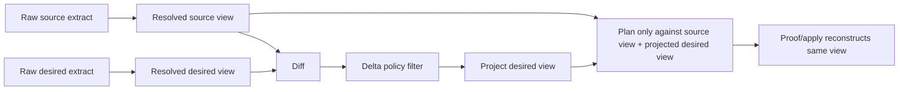
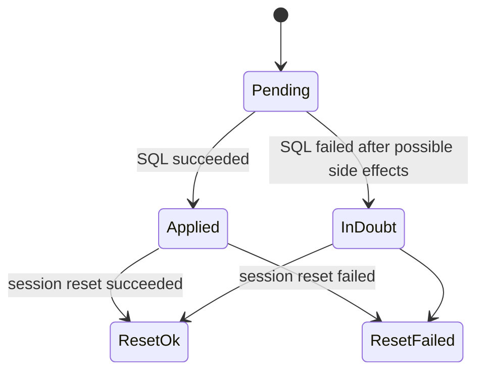
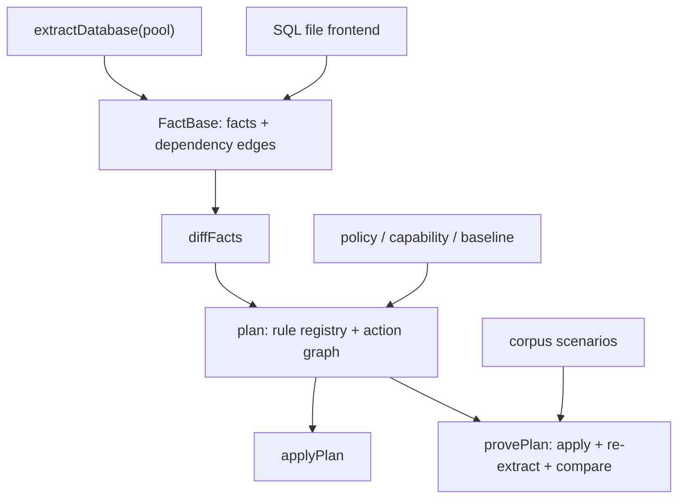

# pg-delta-next branch review

> **Disposition (addressed 2026-06-15):** all correctness findings were fixed —
> P0-1 (depends-edge requirement invariant, `src/plan/internal.ts`), P0-2
> (view-aware apply/prove gate + baseline fail-loud), the P1s (foreign-table
> constraints + corpus scenario, non-transactional apply reset/inDoubt, symmetric
> SQL-file leak detection, system dangling-edge noise) and the P2/P3s (proof
> dotted-id keying, export path safety, `check_function_bodies` reset, non-txn
> file-fallback guard, idle-pool logging). Each is TDD'd and corpus-validated. The
> structural/perf *refactor* suggestions are tracked in
> [`../roadmap/tier-3-engine-refactors.md`](../roadmap/tier-3-engine-refactors.md).

Date: 2026-06-15

Branch reviewed: `feat/pg-delta-next`

Merge base used for orientation: `115dde87af59dbbf531ecb5cf81b4854145a9958`

Head reviewed: `f23fffb761d11ce04902ee35de2500d150477edc`

## Scope

This review focused on the from-scratch `pg-delta-next` rewrite in this branch, with particular attention to:

- correctness of extraction, planning, applying, and proof;
- performance and algorithmic leverage in the core path;
- clarity of the public API, CLI, and documentation for a newcomer;
- opportunities to simplify the internal Modules without flattening the deep Interfaces.

The branch is large: roughly 613 changed files and 33k inserted lines relative to the merge base. I prioritized the new `packages/pg-delta-next` implementation and the docs that explain its architecture and roadmap.

## Executive summary

The rewrite has a strong core shape. The `FactBase` / `StableId` / dependency-edge model is a good deep Interface: it gives the planner, proof loop, corpus runner, and SQL-file frontend a shared vocabulary without forcing each part to understand every catalog detail. The corpus/proof machinery is also a strong choice: it turns "we think this migration is equivalent" into a mechanically checked claim against a real database.

I did find several correctness issues that should be fixed before treating the branch as complete. The most important one is that policy-filtered planning currently computes a projected target fingerprint, but still emits actions and builds the dependency graph against the unprojected target. That can produce migrations that reference objects whose creation was filtered out, and the planner does not reject the plan. I also found an extractor coverage gap for constraints on foreign tables, an apply/proof fingerprint mismatch for policy and baseline-shaped plans, non-transactional apply failure-reporting issues, and SQL-file frontend edge cases around shared-object leakage and path safety.

Most of these are not signs that the architecture is wrong. They are places where a good abstraction is being bypassed or only partially applied. The main improvement theme is: once a view of the catalog has been resolved, make that view the only source of truth for the rest of the pipeline.

## Validation performed

The following local checks passed after installing dependencies:

| Check | Result |
| --- | --- |
| `cd packages/pg-delta-next && bun run check-types` | Passed |
| `cd packages/pg-delta-next && bun test src/` | Passed, 261 tests |
| `bun run format-and-lint` | Passed |
| `cd packages/pg-delta-next && PGDELTA_NEXT_ONLY=foreign-data-wrapper-operations--full-lifecycle PGDELTA_TEST_IMAGE=postgres:17-alpine bun test tests/engine.test.ts` | Passed |

I also ran two targeted probes:

- a policy-filtered planner probe showing a table can be emitted with a column type provided by an extension whose `add` delta was filtered out;
- a PostgreSQL/testcontainers extraction probe showing a foreign table check constraint exists in `pg_constraint` but is not extracted as a constraint fact.

I did not run the full corpus, the full differential/generative suite, or a long-running performance profile. The findings below are based on static review plus the focused probes above.

## Priority findings

### P0: Filtered planning uses the unprojected target for action emission

Files:

- `packages/pg-delta-next/src/plan/plan.ts:207`
- `packages/pg-delta-next/src/plan/plan.ts:214`
- `packages/pg-delta-next/src/plan/plan.ts:444`
- `packages/pg-delta-next/src/plan/plan.ts:454`
- `packages/pg-delta-next/src/plan/plan.ts:679`
- `packages/pg-delta-next/src/plan/plan.ts:745`
- `packages/pg-delta-next/src/plan/internal.ts:94`

The planner computes all deltas, filters them, and then computes `projectedDesired` from the filtered deltas:

```ts
const allDeltas = diffFacts(source, desired, params);
const deltas = filterDeltas(allDeltas, policy);
const projectedDesired = projectTarget(source, desired, deltas);
```

However, action emission and dependency graph construction still use the original `desired` fact base in important places. `projectedDesired` is used for the target fingerprint, but not as the catalog view from which the plan is actually emitted.

That means a policy can remove the delta that creates a dependency while leaving another desired fact that depends on it. The emitted action can reference the missing dependency and still survive graph validation because the graph is built from the unprojected desired state.

Focused repro:

- source contains only `schema:public`;
- desired contains `extension:hstore`, table `public.t`, column `public.t.h hstore`, and an edge from the column to the extension;
- policy excludes `add:extension`;
- planner emits:

```sql
CREATE TABLE "public"."t" ("h" hstore)
```

No `CREATE EXTENSION "hstore"` action is emitted, and the planner does not fail. Applying this migration to a database without `hstore` fails.

This is the highest-priority correctness issue because it cuts across every policy-shaped plan, including product integrations and partial planning.

Recommended fix:

- Treat `projectedDesired` as the canonical desired state for the rest of planning after delta filtering.
- Use it for rename matching, `adds`, `removes`, `sets`, `paramsFor`, `emitCreate`, default-privilege hygiene, forced rebuild detection, and dependency graph construction.
- Add a graph invariant: for every desired dependency edge from a produced fact, the target must either already exist in source or be produced by the plan. This catches missing requirements even when an `ActionSpec` forgets to list a `consumes` edge.
- Add a regression that filters out an extension add while preserving an extension-typed table/column, and assert planning fails or projects the dependent object out.

### P0: Apply/proof fingerprint gates are not policy or baseline aware

Files:

- `packages/pg-delta-next/src/plan/plan.ts:182`
- `packages/pg-delta-next/src/plan/plan.ts:193`
- `packages/pg-delta-next/src/plan/plan.ts:744`
- `packages/pg-delta-next/src/apply/apply.ts:111`
- `packages/pg-delta-next/src/proof/prove.ts:394`
- `packages/pg-delta-next/src/cli/commands/apply.ts:49`
- `packages/pg-delta-next/src/cli/commands/schema.ts:247`

`plan()` resolves the source and desired through `resolveView`, applying policy, capability, and baseline. The returned `source.fingerprint` is therefore the fingerprint of the resolved planning view, not necessarily the raw extracted database.

`apply()` then extracts the current target database and compares the raw `current.factBase.rootHash` against `thePlan.source.fingerprint`. It does not reconstruct the same policy/capability/baseline view first. This rejects valid policy-scoped plans whenever excluded objects are present in the real database.

Baseline is more problematic: the plan does not carry enough baseline data for `apply()` or `provePlan()` to reconstruct the planning view. `provePlan()` accepts policy/capability, but not baseline. A baseline-subtracted plan can therefore be planned, but the default apply/proof gate cannot reliably validate the same source shape.

Recommended fix:

- Store the view metadata required to reconstruct the planning source and target in the plan artifact.
- At minimum, distinguish raw source fingerprint from resolved-view source fingerprint.
- For baseline plans, store a baseline fingerprint plus enough information to load or embed the baseline fact base.
- Make `apply()` run the same `resolveView` before checking fingerprints, or make the API explicit that `apply()` gates raw catalogs only and cannot safely apply view-shaped plans.
- Add policy and baseline apply/proof tests. The policy test should include an excluded object on the target database and confirm the fingerprint gate still accepts the plan when the scoped view matches.

### P1: Foreign-table constraints are silently omitted from extraction

Files:

- `packages/pg-delta-next/src/extract/extract.ts:582`
- `packages/pg-delta-next/src/extract/extract.ts:591`
- `packages/pg-delta-next/src/extract/extract.ts:592`
- `packages/pg-delta-next/COVERAGE.md:7`

The coverage docs say constraints and foreign tables are modeled. The constraint extractor currently joins only relations where `relkind IN ('r', 'p')`, which excludes foreign tables (`relkind = 'f'`).

PostgreSQL supports check constraints on foreign tables:

```sql
CREATE EXTENSION file_fdw;
CREATE SERVER s FOREIGN DATA WRAPPER file_fdw;
CREATE FOREIGN TABLE app.ft (id integer) SERVER s OPTIONS (filename '/tmp/x.csv', format 'csv');
ALTER FOREIGN TABLE app.ft ADD CONSTRAINT ft_id_check CHECK (id > 0);
```

In a focused extraction probe, `pg_constraint` contained:

```json
{"conname":"ft_id_check","contype":"c"}
```

but `extractDatabase()` returned no `constraint` fact for it.

This creates a blind spot: source and desired can differ on a foreign-table constraint while the modeled facts appear equal. Proof can pass vacuously because neither side contains the missing fact. The diagnostic system may emit a dangling dependency edge, but that is not a substitute for modeling the object.

Recommended fix:

- Include `relkind = 'f'` in the constraint extractor for supported constraint types.
- Confirm serializer rules emit the correct `ALTER FOREIGN TABLE` syntax when needed. If PostgreSQL accepts `ALTER TABLE` for these forms, document that choice with a regression.
- Add a corpus scenario or integration test for a foreign-table check constraint add/drop/change.
- Update `COVERAGE.md` to distinguish "modeled family, partially scoped" from "fully modeled".

### P1: Non-transactional apply can misreport state and leak session settings

Files:

- `packages/pg-delta-next/src/apply/apply.ts:142`
- `packages/pg-delta-next/src/apply/apply.ts:148`
- `packages/pg-delta-next/src/apply/apply.ts:157`

For non-transactional actions, `apply()` sets session-level parameters, executes the SQL, and then runs `RESET ALL`. If the action fails, execution jumps to the catch block before `RESET ALL`. The pooled client can be released with altered `lock_timeout`, `statement_timeout`, or `check_function_bodies`.

There is also a reporting issue. Failed non-transactional DDL can leave durable side effects even when the SQL statement reports failure. Examples include interrupted concurrent index builds that leave invalid indexes behind. The current catch path reports all remaining actions as `unapplied`, which can falsely imply the target is unchanged.

The reverse problem can happen if the DDL succeeds but `RESET ALL` fails: the action is reported as failed even though its side effect already occurred.

Recommended fix:

- Wrap reset logic in `finally`.
- Track action state separately from session-reset state.
- For non-transactional failures, report an `inDoubt` status or equivalent. The caller needs to know that the database may require re-extraction before retrying.
- Add a regression using a deliberately failing non-transactional action and assert session state is reset before client release.

### P1: SQL-file frontend shared-object leak detection is asymmetric

Files:

- `packages/pg-delta-next/src/frontends/load-sql-files.ts:319`
- `packages/pg-delta-next/src/frontends/load-sql-files.ts:332`
- `packages/pg-delta-next/src/frontends/load-sql-files.ts:358`

The loader documentation says `databaseScratch` snapshots `pg_roles` and `pg_auth_members` and throws if the sets differ after loading SQL files. The implementation only rejects roles or memberships that appear after the load but were not present before.

That catches:

- `CREATE ROLE new_role`;
- `GRANT existing_role TO existing_member` when that edge was absent.

It misses:

- `DROP ROLE existing_role`;
- `REVOKE existing_role FROM existing_member`;
- changes to membership options such as `admin_option`.

All of those are cluster-level side effects in shared scratch mode.

Recommended fix:

- Compare full before/after sets symmetrically.
- Include membership options in the key or value being compared.
- Add tests for addition, removal, and option mutation.
- Keep the current add-only check as a clearer error message category, but do not make it the only guard.

### P1: Extraction diagnostics are too noisy for system dependency edges

Files:

- `packages/pg-delta-next/src/extract/extract.ts:1917`
- `packages/pg-delta-next/src/extract/extract.ts:1928`
- `packages/pg-delta-next/src/extract/extract.ts:1956`
- `packages/pg-delta-next/src/extract/extract.ts:1961`

The extractor has a good comment explaining that built-in or unmodeled dependency endpoints should resolve to `null` so they can be skipped quietly. In practice, a focused extraction probe printed a very large number of `dangling_edge` diagnostics for `pg_catalog` and `information_schema` views, domains, schemas, and procedures.

This is not just cosmetic. The diagnostic stream is the Interface by which the extractor tells a user, "I saw something important that the model did not." If hundreds of expected system edges are reported, real user-facing issues can be buried. In my foreign-table constraint probe, the missing constraint showed up only indirectly as one dangling edge among a flood of system diagnostics.

Recommended fix:

- Move the system-scope filter into the dependency endpoint resolver, not only into downstream diagnostics.
- Treat built-in endpoints as `null` unless the model intentionally emits the corresponding built-in fact.
- Keep user-schema dangling edges loud.
- Add a small diagnostic budget test: extracting a simple database with FDWs/views should not produce pages of system dangling edges.

### P2: Proof auto-seeding collides on dotted identifiers

Files:

- `packages/pg-delta-next/src/proof/prove.ts:160`
- `packages/pg-delta-next/src/proof/prove.ts:196`
- `packages/pg-delta-next/src/proof/prove.ts:221`

`tableStats` uses string keys like `${schema}.${name}`. `autoSeedEmptyTables` later splits the key on `"."`.

PostgreSQL identifiers can contain dots. These two relations collide:

- schema `"a.b"`, table `"c"`;
- schema `"a"`, table `"b.c"`.

The split logic can also quote the wrong schema/table pair when trying to seed empty tables.

Recommended fix:

- Use an encoded `StableId` as the map key, or store `{ schema, name }` as the value and never parse a display string.
- Add proof tests with dotted schema and table identifiers.

### P2: Exported SQL file paths use raw database identifiers

Files:

- `packages/pg-delta-next/src/frontends/export-sql-files.ts:73`
- `packages/pg-delta-next/src/frontends/export-sql-files.ts:81`
- `packages/pg-delta-next/src/frontends/export-sql-files.ts:93`
- `packages/pg-delta-next/src/cli/commands/schema.ts:103`

The SQL-file exporter uses raw schema, object, extension, and role names as path segments. The CLI writes `join(outDir, file.name)`.

Database identifiers can contain `/`, `..`, backslashes, and other path-significant characters. A database object can therefore cause export to write outside the intended output directory or create a surprising nested tree.

Recommended fix:

- Encode every database identifier path segment with a reversible, path-safe encoding.
- Consider a manifest that maps encoded paths back to stable ids and display names.
- Assert after joining that every destination path remains under `outDir`.
- Add regression tests with identifiers containing `/`, `..`, and dots.

### P2: SQL-file loading can leak `check_function_bodies = off`

Files:

- `packages/pg-delta-next/src/frontends/load-sql-files.ts:285`
- `packages/pg-delta-next/src/frontends/load-sql-files.ts:383`

`loadSqlFiles` sets `check_function_bodies = off` before loading files and turns it back on after successful body validation. If loading fails before that point, the client can be released with body checking disabled.

Recommended fix:

- Use `SET LOCAL check_function_bodies = off` inside explicit transactions where possible.
- Otherwise, reset in `finally`.
- Add a test that forces a load error and verifies the setting is restored.

### P2: Non-transactional SQL file fallback should be constrained

Files:

- `packages/pg-delta-next/src/frontends/load-sql-files.ts:58`
- `packages/pg-delta-next/src/frontends/load-sql-files.ts:66`

`applyFile` first tries to execute a whole file inside a transaction. If PostgreSQL reports `25001`, it retries the entire file outside the transaction.

This is understandable as a pragmatic loader for statements such as `CREATE INDEX CONCURRENTLY`, but the Module's behavior is ambiguous when a file contains multiple statements around a non-transactional statement. The raw retry may partially apply statements before failing, and callers do not get a structured "in doubt" result.

Recommended fix:

- Require non-transactional statements to live in singleton files.
- Detect and fail early when a file mixes transaction-only and non-transactional statements.
- If statement splitting is needed, prefer a proven parser or server-side strategy rather than ad hoc string parsing.

### P3: Idle pool errors are swallowed

File:

- `packages/pg-delta-next/src/cli/pool.ts:14`

`makePool` attaches `pool.on("error", () => {})`. That avoids noisy unhandled errors, but it also hides connection failures that would be valuable in CLI troubleshooting.

Recommended fix:

- Log idle pool errors to stderr in verbose/debug mode.
- Include the connection label without printing credentials.

## Performance and simplification opportunities

### Use the projected fact base as the main planning Interface

The planner already has the right Interface: `FactBase`. The policy/baseline/capability path should produce another `FactBase`, and every later step should treat that as the complete world.

That would simplify reasoning about correctness:



Right now the code follows this diagram for fingerprinting, but not for action emission. Making the diagram true in code would remove a large class of bugs.

### Precompute planner maps and reverse dependency indices

Files:

- `packages/pg-delta-next/src/plan/plan.ts:297`
- `packages/pg-delta-next/src/plan/plan.ts:325`
- `packages/pg-delta-next/src/plan/plan.ts:573`

The forced rebuild loop scans all source edges each round. Replacement paths also use repeated `source.facts().find(...)` and `desired.facts().find(...)`.

For small schemas this is fine. For large schemas, this creates avoidable `O(rounds * edges)` and repeated array-copy/search behavior in the hottest Module.

Recommended simplification:

- Build `factsById`, `sourceFactsById`, and `desiredFactsById` maps once.
- Build a reverse dependency index once.
- Express forced rebuild propagation as a graph reachability walk from the initially forced ids.

This improves performance and makes the dependency logic easier to audit.

### Keep `FactBase` deep, but expose lower-allocation iteration helpers

Files:

- `packages/pg-delta-next/src/core/fact.ts`
- `packages/pg-delta-next/src/core/stable-id.ts`

`FactBase` is one of the strongest Modules in the rewrite. It hides canonicalization, hashing, and graph consistency behind a small Interface. A few consumers currently call `facts()` and then search/copy arrays.

Potential additions:

- `get(id: StableId): Fact | undefined`;
- `has(id: StableId): boolean`;
- `values(): Iterable<Fact>`;
- `outgoingEdges(id): readonly Edge[]` already exists and is good;
- maybe `incomingEdges(id): readonly Edge[]` if reverse walks become common.

The goal is not to make `FactBase` wider for convenience. It is to prevent consumers from rebuilding their own indices and accidentally drifting from the canonical representation.

### Split extractor implementation by catalog family without widening the public Interface

File:

- `packages/pg-delta-next/src/extract/extract.ts`

The extractor is doing the right thing architecturally: one call extracts a consistent database snapshot and returns facts, edges, and diagnostics. That is a deep Interface.

The Implementation is now large enough that locality is suffering. Comments at the top are stale, stage-specific helper comments are stale, and a single relkind filter missed foreign-table constraints.

Recommended shape:

- keep `extractDatabase()` as the public Interface;
- split internal query builders by object family, for example `relations`, `constraints`, `functions`, `policies`, `publications`, `rls`, `security-labels`, `event-triggers`;
- keep shared scope and dependency resolver helpers in one place;
- add one small per-family coverage test when the family has surprising PostgreSQL scope rules.

This is a locality improvement, not a request to invent a new abstraction layer.

### Keep one rule registry Interface, but split rule definitions by kind

File:

- `packages/pg-delta-next/src/plan/rules.ts`

The declarative rule table is valuable. It makes the planner generic and keeps object-specific DDL isolated. The file is now large enough that finding the rule for a kind is slow, and reviewing changes risks missing nearby interactions.

Recommended shape:

- keep a single exported registry as the planner Interface;
- move rule definitions into family files;
- compose them in `rules.ts`;
- keep shared helpers in one place.

This preserves the current leverage while improving code review locality.

### Treat non-transactional actions as a separate state machine

File:

- `packages/pg-delta-next/src/apply/apply.ts`

Transactional apply has a simple state model: either the transaction commits or it rolls back. Non-transactional apply does not. It deserves a small explicit state machine:



This would make retry behavior, CLI messages, and user expectations clearer.

## Documentation findings

### Stale roadmap links

Files:

- `docs/roadmap/v1.md:8`
- `docs/roadmap/v1.md:114`
- `docs/roadmap/README.md:5`
- `docs/roadmap/v1-evidence.md:6`

Several docs still reference `remaining-work/` or `pg-delta-next-remaining-work.md`, but the branch reorganized the roadmap under `docs/roadmap/`.

Recommended fix:

- Replace stale links with the current roadmap index.
- Add a small "where to start" section in `docs/roadmap/README.md`.

### Stale corpus count

File:

- `packages/pg-delta-next/README.md:50`

The README says the corpus has about 195 scenarios. Current roadmap/docs refer to 209 scenarios.

Recommended fix:

- Use the exact generated corpus count where possible, or say "200+" to avoid frequent stale updates.
- Consider generating the count into coverage/evidence docs as part of the corpus runner.

### `API-REVIEW.md` is behind the current API

File:

- `packages/pg-delta-next/API-REVIEW.md:61`

`PlanOptions` is documented as `{ params?, policy?, renames?, acceptRenames?, compact? }`, but the implementation includes newer concepts such as `baseline` and `capability`.

Recommended fix:

- Update the public API review after settling the policy/baseline fingerprint story.
- Add a small lifecycle example: extract -> plan with policy/baseline -> prove -> apply.

### `PORTING.md` says security labels are not extracted

File:

- `packages/pg-delta-next/PORTING.md:20`

The README and coverage docs say security labels are implemented/proven, while `PORTING.md` still says they are not yet extracted.

Recommended fix:

- Update the porting status or remove stale implementation status from `PORTING.md` if `COVERAGE.md` is the source of truth.

### Extractor comments still describe an earlier stage

Files:

- `packages/pg-delta-next/src/extract/extract.ts:15`
- `packages/pg-delta-next/src/extract/extract.ts:124`

The top extractor comment says coverage includes only schema/role/extension/table/etc., and another comment labels `notExtensionMember` as a stage-8 TODO. The extractor now covers many more object classes and includes some extension-member provenance.

Recommended fix:

- Replace stage-history comments with current invariants.
- If a comment is meant to describe a known limitation, link it to `COVERAGE.md`.

### Add a newcomer architecture map

The docs are already substantial, but a new contributor needs a short map that answers:

- Where do facts come from?
- How does a new catalog object get modeled?
- How does planning decide ordering?
- What proves a change safe?
- Where should product-specific policy live?

Suggested diagram:



Suggested "add a new object kind" checklist:

1. Define the stable id shape.
2. Extract the fact and dependency edges from `pg_catalog`.
3. Add the rule registry entries for add/drop/replace/alter.
4. Add a focused unit test for serialization if useful.
5. Add a corpus scenario that proves roundtrip equivalence.
6. Update coverage docs.

### Make coverage claims evidence-shaped

`COVERAGE.md` is very useful, but the foreign-table constraint gap shows the current categories are too coarse. A better table shape would be:

| Family | Extracted | Planned | Proven | Known scope limits |
| --- | --- | --- | --- | --- |
| Constraints | Yes | Yes | Yes | Check constraints on foreign tables covered? Exclusion constraints? |
| Foreign tables | Yes | Yes | Yes | Local constraints and options separately listed |

This lets docs be confident without overclaiming.

## Suggested next work order

1. Fix the projected-target planning bug and add dependency-completeness graph assertions.
2. Fix the apply/proof fingerprint model for policy, capability, and baseline-shaped plans.
3. Patch foreign-table constraint extraction and add corpus coverage.
4. Harden non-transactional apply reporting and session reset.
5. Fix SQL-file frontend side-effect detection and path encoding.
6. Quiet expected system dependency diagnostics while preserving user-facing warnings.
7. Update stale docs and add the newcomer architecture map.
8. Profile the planner on a large extracted schema after the correctness fixes, then add reverse-edge and fact lookup indices where the profile confirms pressure.

## Closing assessment

The rewrite is close to having the right long-term architecture. The strongest part is the deep fact graph Interface: it gives the system a single language for extraction, planning, proof, corpus scenarios, and product policy. The main issues are not that the Modules are too abstract; they are cases where later stages still peek at the wrong catalog view or assume a simpler world than PostgreSQL allows.

If the project tightens those view boundaries and makes proof/apply reconstruct the same world that planning saw, the implementation will be much easier to reason about and much harder to accidentally regress.
